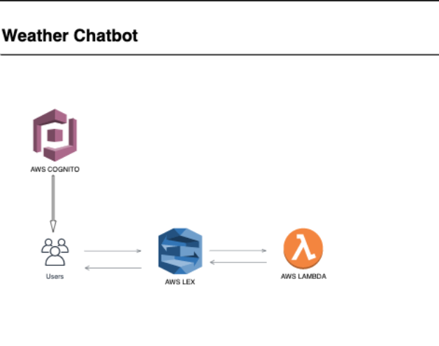

What it does:
 *  It's a chatbot that can answer any weather related question relating to any region in the world. 
 *  You could ask questions like “what is the weather in london” and the chatbot would return a comprehensive answer regarding the weather in london. “You could  
    also ask questions like what will the weather be like tomorrow in SFO” and the chatbot would return future predicted weather events as well as past related 
    weather events.

Services I used:
 *  AWS Lex: AI based conversational base made by amazon for building chatbots
 *  AWS Amplify: Deploying the applications and integration
 *  Angular JS: frontend javascript application

How I built it:
 *  Built the chatbot using AWS Lex
 *  Connected the chatbot to the weather API using AWS Lambda 
 *  Created an angular web application and integrated it to the chatbot using AWS Amplify
 *  Overall the chatbot backend was constructed using Lex Functions to answer personalized weather related questions. The API for all information retrieval for a  
    certain query for Lex would send a request to the API and the API return’s information which later lex processes into a proper response to the user query. The     frontend was constructed using AngularJS and used the middleware to integrate the frontend and backend. I used AWS Amplify.
 
